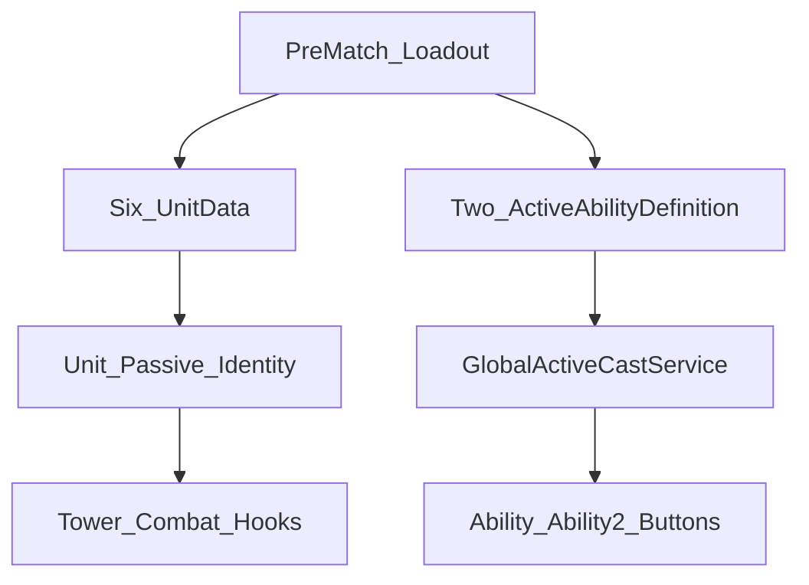

# Option A — Ability Architecture

**Status:** Locked (client direction + Day 2 design note)  
**Product rule:** Pre-match loadout = **6 units + 2 global active abilities**.

## Three layers

| Layer | What it is | Player action | Examples |
|-------|------------|---------------|----------|
| **Global Active Abilities** | Shared pool; pick 2 before match | Manual cast on cooldown | Meteor Strike, Frost Nova, Mana Surge, Radiant Cleanse, Arcane Overclock, Execution Sigil |
| **Unit Identity / Passives** | Always on or auto from the unit | None (or drag-special) | Frost slow on hit, Fire AoE on hit, poison DoT, Enchantress buff, Gold Spirit mana ticks, Zeus chain |
| **Board Utilities** | Special drag interactions | Drag on board | Shapeshifter copy, Light Fairy upgrade |

## Rules

1. In-match **Ability / Ability_2** buttons cast the **pre-selected global actives only**.
2. Buttons must **not** bind to the selected tower’s hero ability (`HeroAbilityButtonController` is temporary prototype UX).
3. Unit scripts stay as **Skill-1 identity / passives**; they do not own the global loadout.
4. Do **not** expand tower-selected ability binding as a product feature.
5. New global actives are authored as `ActiveAbilityDefinition` under `Assets/Content/Abilities/` — values change without code when the cast system reads the SO (M2 implements cast).

## GDD §17 trigger categories (future contracts)

Unit passives and future skills should map to shared triggers:

- On Hit  
- On Kill  
- On Boss Spawn  
- On Merge  
- On Interval  
- On Condition  
- On In-Match Rank  
- On Shield Break / Debuff End / Death  

Day 2: document only. Implementation of a shared trigger bus is M2+.

## Prototype path (quarantine — Day 3 code)

| Item | Status |
|------|--------|
| `HeroAbilityButtonController` | Non-product; disable/isolate on Day 3 |
| `TowerAbilityBase.SupportsManualActivation` default true | Prototype; passives should not drive HUD globals |
| Ability / Ability_2 HUD buttons | Keep visuals; rebind to global loadout in M2 |

## Launch pool (6)

See `NamingMap.md`. Stretch: Gravity Well, Barrier Pulse.
